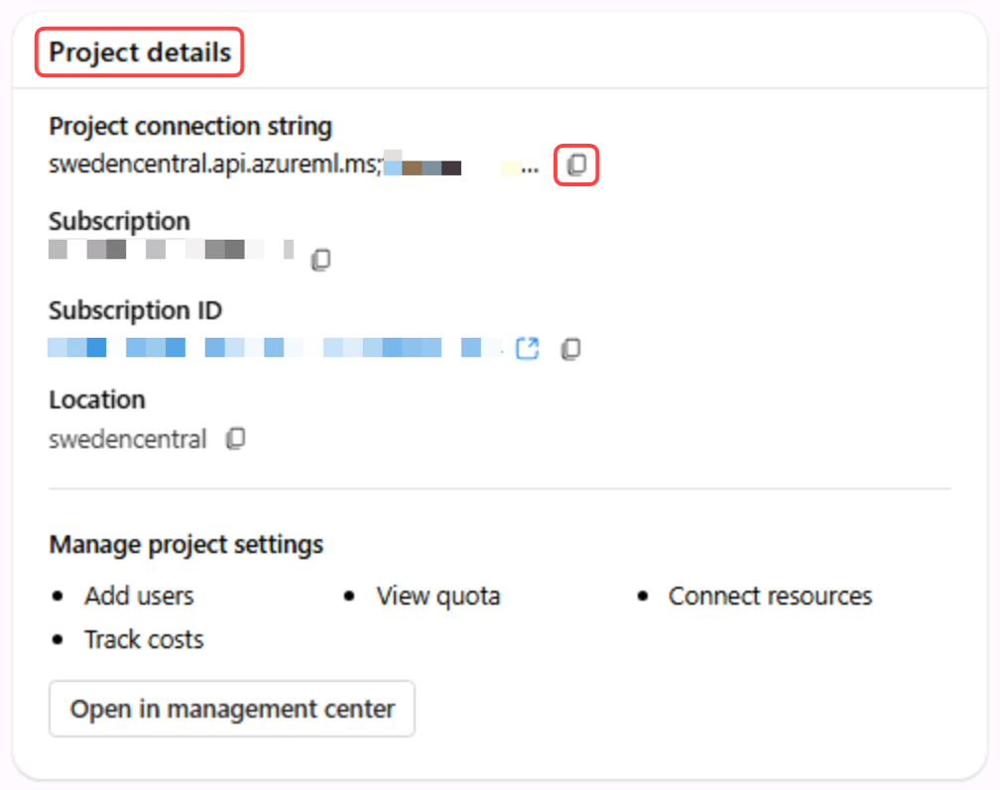

These instructions are for self-guided learners who are not part of the AI Tour and do not have access to a pre-configured lab environment. Follow these steps to set up your environment and begin the workshop.

## Getting Started with the Workshop

This workshop is designed to teach you about the Azure AI Agents Service and the Python SDK. It consists of multiple labs, each highlighting a specific feature of the Azure AI Agents Service. The labs are meant to be completed in order, as each one builds on the knowledge and work from the previous lab.

### GitHub Codespaces

The preferred way to run this workshop is using GitHub Codespaces. This option provides a pre-configured environment with all the tools and resources needed to complete the workshop.

Select the **Open in GitHub Codespaces** to open the project in GitHub Codespaces.

[](https://codespaces.new/microsoft/build-your-first-agent-with-azure-ai-agent-service-workshop){:target="_blank"}

!!! Warning "It will take several minutes to build the Codespace so carry on reading the instructions while it builds."

## Lab Structure

Each lab in this workshop includes:

- An **Introduction**: Explains the relevant concepts.
- An **Exercise**: Guides you through the process of implementing the feature.

## Project Structure

The workshop’s source code is located in the **src/workshop** folder. Be sure to familiarize yourself with the key **subfolders** and **files** you’ll be working with throughout the session.

1. The **files folder**: Contains the files created by the agent app.
1. The **instructions folder**: Contains the instructions passed to the LLM.
1. The **main.py**: The entry point for the app, containing its main logic.
1. The **sales_data.py**: Contains the function logic to execute dynamic SQL queries against the SQLite database.
1. The **stream_event_handler.py**: Contains the event handler logic for token streaming.


## Authenticate with Azure

You need to authenticate with Azure so the agent app can access the Azure AI Agents Service and models. Follow these steps:

1. Open a new terminal window in VS Code. From the **VS Code menu**, select **Terminal**, then **New Terminal**.
2. Run the following command to authenticate with Azure:

    ```powershell
    az login --use-device-code
    ```

    !!! note
        You'll be prompted to open a browser link and log in to your Azure account.

        1. A browser window will open automatically, select your account type and click **Next**.
        2. Sign in with your Azure subscription **Username** and **Password**.
        3. Select **OK**, then **Done**.

3. Then select the appropriate subscription from the command line.
4. Leave the terminal window open for the next steps.

## Deploy the Azure Resources

From the VS Code terminal run the following command:

```bash
cd infra && ./deploy.sh
```

<!-- ## Project Connection String

Next, we log in to Azure AI Foundry to retrieve the project connection string, which the agent app uses to connect to the Azure AI Agents Service.

1. Navigate to the [Azure AI Foundry](https://ai.azure.com){:target="_blank"} website.
2. Sign in with your Azure subscription **Username** and **Password**.
3. Read the introduction to the Azure AI Foundry and click **Got it**.
4. Ensure you are on the AI Foundry home page. Click the **AI Foundry** tab in the top left corner.

    {:width="200"}

5. Select the **agent-workshop** project.
6. Review the introduction guide and click **Close**.
7. Locate the **Project details** section, click the **Copy** icon to copy the **Project connection string**.

    {:width="500"} -->

## Workshop Configuration

The deploy script generates the **src/workshop/.env** file, which contains the project connection string, model deployment name, and Bing connection name.

Your **.env** file should look similar to this but with your project connection string.

```python
MODEL_DEPLOYMENT_NAME="gpt-4o"
BING_CONNECTION_NAME="Grounding-with-Bing-Search"
PROJECT_CONNECTION_STRING="<your_project_connection_string>"
```
