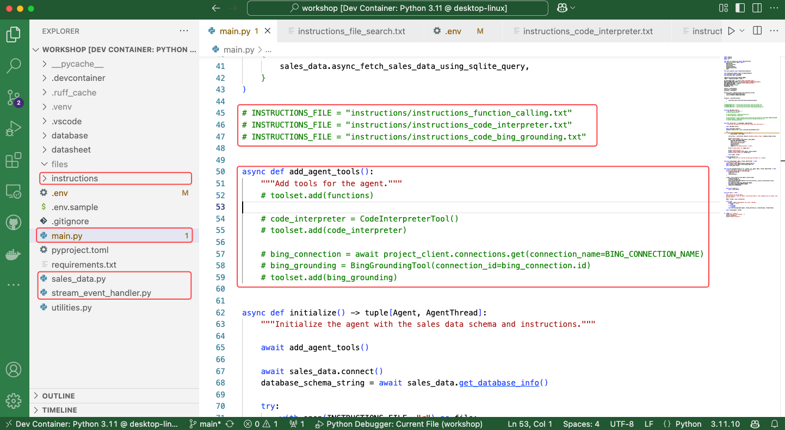
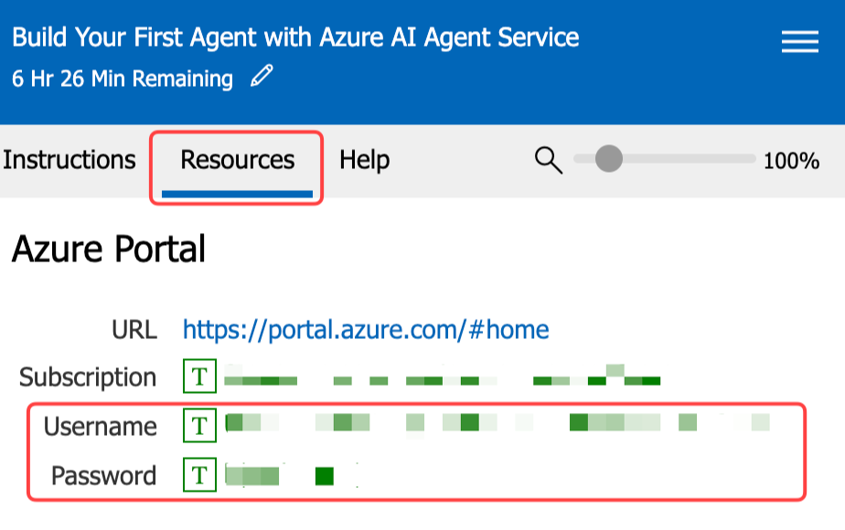
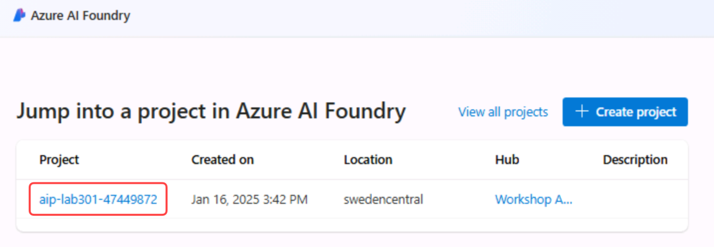

# Getting Started with the Workshop

This workshop is designed to teach you about the Azure AI Agents Service and the Python SDK. It consists of multiple labs, each highlighting a specific feature of the Azure AI Agents Service. The labs are meant to be completed in order, as each one builds on the knowledge and work from the previous lab.

## AI Tour Lab Environment

The instructions for this workshop assume you are participating in the AI Tour and have access to a pre-configured lab environment. This environment contains all the tools and resources needed to complete the workshop. Otherwise, you can [deploy](./deployment.md) the workshop resources to your Azure subscription.

## Lab Structure

Each lab in this workshop includes:

- An **Introduction**: Explains the relevant concepts.
- An **Exercise**: Guides you through the process of implementing the feature.

## Viewing Images

!!! tip "If you have trouble viewing an image, simply click the image to enlarge it."

## Project Structure

When you open the workshop in Visual Studio Code, you'll see the following folder structure. Take note of the key folders and files you'll be working with during the workshop:

1. The **instructions**: folder contains the instructions passed to the LLM.
2. The **main.py**: The entry point for the app, containing its main logic.
3. The **sales_data.py**: Contains the function logic to execute dynamic SQL queries against the SQLite database.
4. The **stream_event_handler.py**: Contains the event handler logic for token streaming.

{:width="500"}

## Open the Workshop

Follow these steps to open the workshop in Visual Studio Code:

1. Open a terminal window. The terminal app is **pinned** to the Windows 11 taskbar.

    { width="300" }

1. Open a terminal window and execute the following commands to clone the workshop repository, navigate to the relevant folder, set up a virtual environment, activate it, and install the required packages:

    ```powershell
    git clone https://github.com/gloveboxes/build-your-first-agent-with-azure-ai-agent-service-lab.git `
    ; cd build-your-first-agent-with-azure-ai-agent-service-lab/src/workshop `
    ; python -m venv .venv `
    ; .\.venv\Scripts\activate `
    ; pip install -r requirements.txt
    ```

<!-- 2. From the terminal window, clone the workshop repo by running the following command:

    ```powershell
    git clone https://github.com/gloveboxes/build-your-first-agent-with-azure-ai-agent-service-lab.git
    ```

1. Navigate to the workshop `src/workshop` folder for the repository you cloned in the previous step.

    ```powershell
    cd build-your-first-agent-with-azure-ai-agent-service-lab/src/workshop
    ```

2. Create a virtual environment by running the following command:

    ```powershell
    python -m venv .venv
    ```

3. Activate the virtual environment by running the following command:

    ```powershell
    .\.venv\Scripts\activate
    ```

4. Install the required packages by running the following command:

    ```powershell
    pip install -r requirements.txt
    ``` -->

5. Open in VS Code. From the terminal window, run the following command:

    ```powershell
    code .
    ```

## Project Connection String

Log into [Azure AI Foundry](https://learn.microsoft.com/azure/ai-studio/what-is-ai-studio){:target="_blank"} to retrieve the **project connection string**, which the agent app uses to connect to the Azure AI Agents Service.

1. Navigate to the [Azure AI Foundry](https://ai.azure.com){:target="_blank"} website.
2. Select **Sign in** and use the **Username** and **Password** found in the top section of the **Resources** tab in the lab environment. Click on the **Username** and **Password** fields to automatically fill in the login details.
    {:width="500"}
3. Read the introduction to the Azure AI Foundry and click **Got it**.
4. Ensure you are on the AI Foundry home page. Click the **AI Foundry** tab in the top left corner.

    {:width="200"}

5. Select the project name that starts with **aip-**.

    {:width="500"}

6. Review the introduction guide and click **Close**.
7. Locate the **Project details** section, click the **Copy** icon to copy the **Project connection string**.

    {:width="500"}

## Configure the Workshop

1. Switch back to workshop you opened in VS Code.
2. **Rename** the `.env.sample` file to `.env`.
3. Paste the **Project connection string** you copied from Azure AI Foundry into the `.env` file.

    ```python
    PROJECT_CONNECTION_STRING="<your_project_connection_string>"
    ```

    Your `.env` file should look similar to this but with your project connection string.

    ```python
    MODEL_DEPLOYMENT_NAME="gpt-4o"
    BING_CONNECTION_NAME="Grounding-with-Bing-Search"
    PROJECT_CONNECTION_STRING="<your_project_connection_string>"
    ```

## Pro Tip

!!! tip
    The **Burger Menu** in the right-hand panel of the lab environment offers additional features, including the **Split Window View** and the option to end the lab. The **Split Window View** allows you to maximize the lab environment to full screen, optimizing screen space. The lab's **Instructions** and **Resources** panel will open in a separate window.
